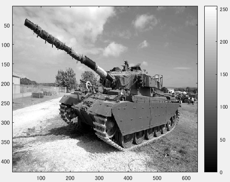
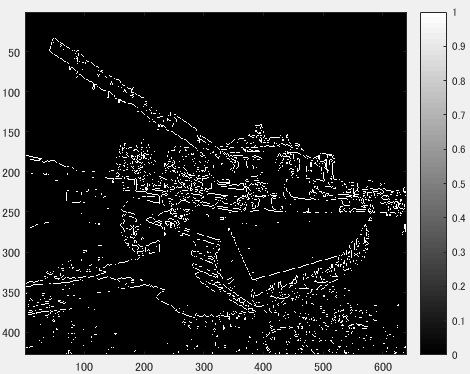
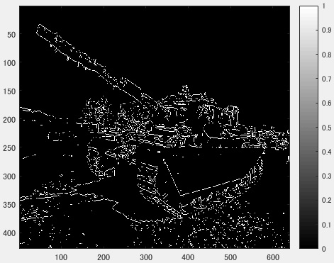
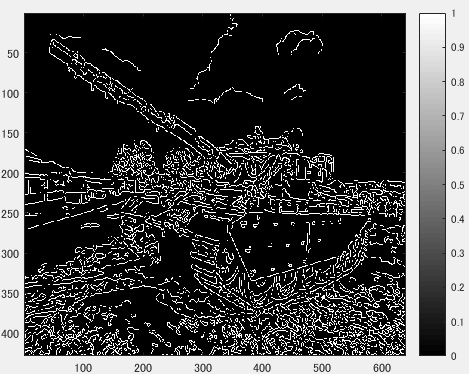

## 課題レポート10　画像のエッジ検出
---
`
課題内容:エッジ検出を体験せよ。
`

`
用意した画像は横640画素、縦428画素のディジタルカラー画像である。この画像を入力して、
プレウィット法、ソベル法、キャニー法を用いたエッジ検出をする。
`

図1　原画像

`
ORG = imread('Centurion.jpg'); % 原画像の入力
`  
`
ORG = rgb2gray(ORG); %カラーからグレイへの変換
`  
`
imagesc(ORG); colormap('gray'); colorbar;% 画像表示
`

`
上記のコードにより、原画像を入力し白黒濃淡画像に変換した後、表示する。その画像が図1である。
`

図2　白黒濃淡画像に変換した原画像

`
以下にソースコードと、結果を示す。
`
- プレウィット法
    - ソースコード

    `
    IMG = edge(ORG,'prewitt'); % エッジ抽出（プレウィット法）
    `
    - 結果

    
    
    図3　プレウィット法
    
- ソベル法
    - ソースコード

    `
    IMG = edge(ORG,'sobel'); % エッジ抽出（ソベル法）
    `
    - 結果

    
    
    図4　ソベル法
    
- キャニー法
    - ソースコード

    `
    IMG = edge(ORG,'canny'); % エッジ抽出（キャニー法）
    `
    - 結果

    
    
    図5　キャニー法

`
3つのエッジ検出の手法を比較すると、キャニー法が最も細かい部分までエッジ検出できるということがわかった。
`
