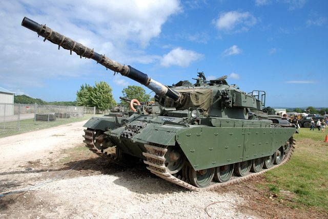

## 課題レポート2　階調数と疑似輪郭
---
`
課題内容：2階調、4階調、8階調の画像を生成せよ。
`

`
用意した画像は横640画素、縦428画素のディジタルカラー画像である。この画像を入力して
それぞれの階調画像を生成し比較する。原画像が図1である。
`

図1　原画像

`
ORG=imread('Centurion.jpg'); % 原画像の入力
`  
`
ORG = rgb2gray(ORG); % カラー画像を白黒濃淡画像へ変換
`  
`
imagesc(ORG); colormap(gray); colorbar; axis image; % 画像の表示
`

`
上記のコードにより、原画像を入力し白黒濃淡画像に変換した後、表示する。その画像が図1である。
`

図2　白黒濃淡画像に変換した原画像

`
階調数とは、画像の濃度値の数である。今回は2, 4, 8階調なので、2階調は2の1乗、4階調は2の2乗、8階調は2の3乗個の
濃度値があるということである。そして、それらの離散的に分けた濃度値を合わせればそれぞれの階調数の画像が出力できる。以下にソースコードと結果を示す。
`
- 2階調
    -  ソースコード

    `
    IMG = ORG>128;
    `

    - 結果

    
    
    図3　2階調のグレースケール画像
    
- 4階調
    - ソースコード

    `
    IMG0 = ORG>64;
    `  
    `
    IMG1 = ORG>128;
    `  
    `
    IMG2 = ORG>192;
    `  
    `
    IMG = IMG0 + IMG1 + IMG2;
    `

    - 結果

    
    
    図4 4階調のグレースケール画像
    
- 8階調
    - ソースコード

    `
    IMG0 = ORG>32;
    `  
    `
    IMG1 = ORG>64;
    `  
    `
    IMG2 = ORG>96;
    `  
    `
    IMG3 = ORG>128;
    `  
    `
    IMG4 = ORG>160;
    `  
    `
    IMG5 = ORG>192;
    `  
    `
    IMG6 = ORG>224;
    `  
    `
    IMG = IMG0 + IMG1 + IMG2 + IMG3 + IMG4 + IMG5 + IMG6;
    `

    - 結果

    
    
    図5 8階調のグレースケール画像

`
以上の結果から、階調数を増やすたびに被写体が鮮明になっていくことがわかる。2階調の時は、被写体と背景とが区別がつかない部分があるが8階調を見ると被写体が鮮明になり原画像に近いものになっている。
`
