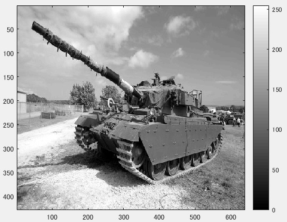
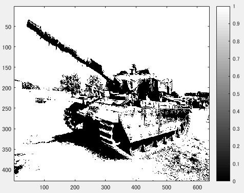

## 課題レポート5　判別分析法
---
`
課題内容:判別分析法を用いて画像を二値化せよ。
`

`
用意した画像は横640画素、縦428画素のディジタルカラー画像である。この画像を入力して、
判別分析法を用いて二値化する。原画像が図1である。
`

図1　原画像

`
ORG=imread('Centurion.jpg'); % 原画像の入力
`  
`
ORG = rgb2gray(ORG); % カラー画像を白黒濃淡画像へ変換
`  
`
imagesc(ORG); colormap(gray); colorbar;
`

`
上記のコードにより、原画像を入力し白黒濃淡画像に変換した後、表示する。その画像が図1である。
`

図2　白黒濃淡画像に変換した原画像

`
以下にソースコードと、判別分析法により二値化した結果を示す。
`

- ソースコード

`
H = imhist(ORG); %ヒストグラムのデータを列ベクトルEに格納
`  
`
myu_T = mean(H);
`  
`
max_val = 0;
`  
`
max_thres = 1;
`  
`
for i=1:255
`  
`
C1 = H(1:i); %ヒストグラムを2つのクラスに分ける
`  
`
C2 = H(i+1:256);
`  
`
n1 = sum(C1); %画素数の算出
`  
`
n2 = sum(C2);
`  
`
myu1 = mean(C1); %平均値の算出
`  
`
myu2 = mean(C2);
`  
`
sigma1 = var(C1); %分散の算出
`  
`
sigma2 = var(C2);
`  
`
sigma_w = (n1 *sigma1+n2*sigma2)/(n1+n2); %クラス内分散の算出
`  
`
sigma_B = (n1 *(myu1-myu_T)^2+n2*(myu2-myu_T)^2)/(n1+n2); %クラス間分散の算出
`  
`
if max_val<sigma_B/sigma_w
`  
`
max_val = sigma_B/sigma_w;
`  
`
max_thres =i;
`  
`
end;
`  
`
end;
`

`
IMG = ORG > max_thres;
`
- 結果

図3　濃度ヒストグラムの生成結果

`
上記の結果から、正しく判別分析法が行われたことがわかる。
`
