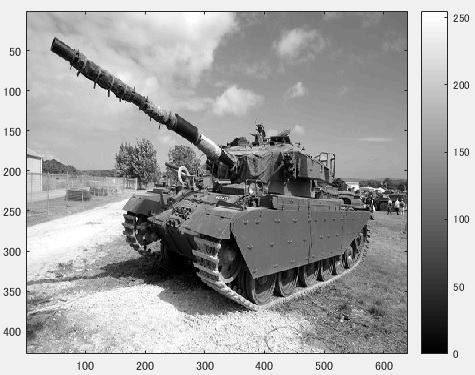
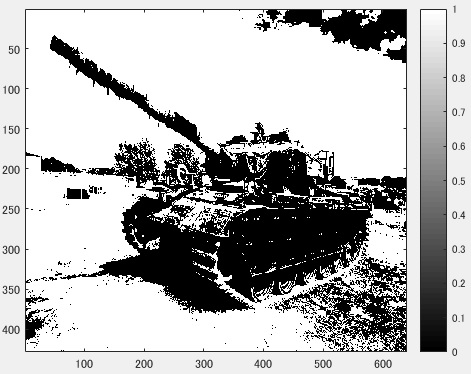
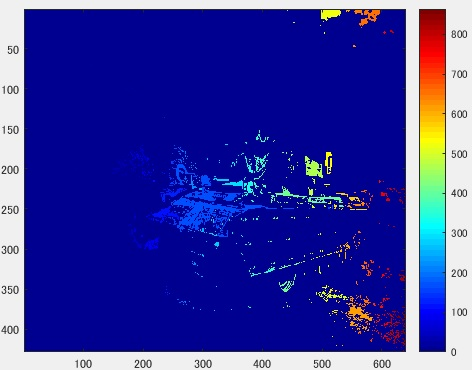

## 課題レポート8　ラベリング
---
`
課題内容:二値化された画像の連結成分にラベルをつけよ。
`

`
用意した画像は横640画素、縦428画素のディジタルカラー画像である。この画像を入力して、
閾値128で二値化しラベリングをする。
`

図1　原画像

`
ORG = imread('Centurion.jpg'); % 画像の読み込み
`  
`
ORG = rgb2gray(ORG); % 白黒濃淡画像に変換
`  
`
imagesc(ORG); colormap(gray); colorbar; % 画像の表示
`

`
上記のコードにより、原画像を入力し白黒濃淡画像に変換した後、表示する。その画像が図1である。
`

図2　白黒濃淡画像に変換した原画像

`
以下にソースコードと、結果を示す。
`
- 閾値128での二値化
    - ソースコード

    `
    IMG = ORG > 128; % 閾値128で二値化
    `
    - 結果

     
    
    図3　閾値128での二値化
    
- ラベリング
    - ソースコード

    `
    IMG = bwlabeln(IMG);
    `
    - 結果

    
    
    図4　ラベリング後の画像

`
被写体に多くラベルが存在していることがわかる。これは被写体に連結成分が密集しているということである。
`
